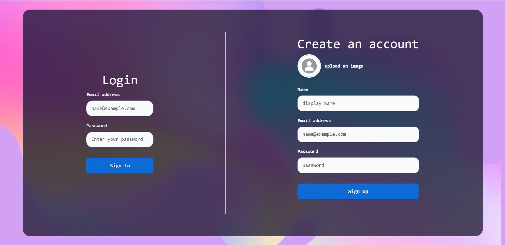
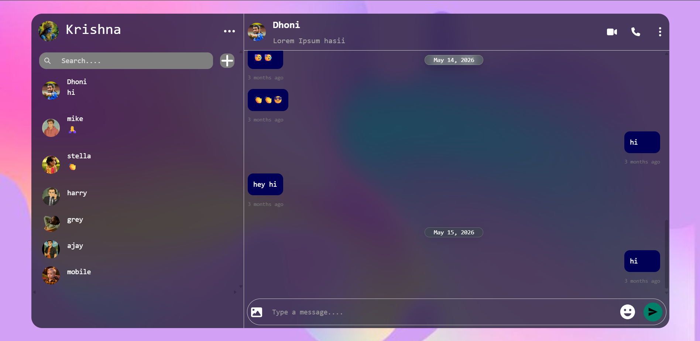

# React Chat App

### A responsive, real-time chat application built with React, Vite, Firebase, Zustand, and Cloudinary.

<div align="center">

[](https://my-react-chat-appl.netlify.app/)
[](#tech-stack)
[](#tech-stack)
[](#tech-stack)
[](#tech-stack)
[](#tech-stack)

</div>

Create an account, find another user, then exchange text, emoji, and image messages in real time.

## Features

- Email and password authentication with Firebase Authentication
- Account creation with optional profile-image upload
- User search and one-to-one conversation creation
- Real-time messages and chat-list updates through Cloud Firestore
- Image attachments uploaded to Cloudinary
- Emoji picker, image preview, and automatic scrolling to new messages
- Relative timestamps and date separators for messages
- Chat search and unread-message highlighting
- Block, unblock, report, and clear-chat controls
- Responsive back navigation for chat and contact-detail views
- Toast notifications for account and upload actions

## Screenshots

<div align="center">
  
  
</div>

## Tech Stack

- React 19 with Vite
- Firebase Authentication and Cloud Firestore
- Zustand for application state
- Cloudinary and Axios for image uploads
- React Bootstrap, React Icons, React Toastify, date-fns, and emoji-picker-react

## Getting Started

### Prerequisites

- Node.js 18 or newer
- A Firebase project with Email/Password authentication and Cloud Firestore enabled
- A Cloudinary account with an unsigned upload preset

### Install Dependencies

```bash
npm install
```

### Configure Firebase

Create a `.env` file at the project root:

```env
VITE_API_KEY=your_firebase_web_api_key
```

The other Firebase settings are currently in `src/ConfigFirebase/ConfigFirebase.jsx`. Update them when connecting the app to your own Firebase project.

### Configure Cloudinary

Cloudinary's cloud name and upload preset are currently set in:

- `src/Pages/SignUp/SignUp.jsx`
- `src/Components/ChatPanel/ChatPanel.jsx`

Before deploying, replace `dmrgvxawa` and `ReactChatAppUploads` with your own cloud name and unsigned upload preset.

### Start the App

```bash
npm run dev
```

Vite will print the local URL, usually `http://localhost:5173`.

## Scripts

| Command | Description |
| --- | --- |
| `npm run dev` | Start the development server. |
| `npm run build` | Build the production app into `dist`. |
| `npm run preview` | Preview the production build locally. |
| `npm run lint` | Run ESLint. |

## Firestore Collections

| Collection | Purpose |
| --- | --- |
| `users` | Stores user profiles, avatars, and blocked-user IDs. |
| `userChats` | Stores each user's conversation list and message metadata. |
| `chats` | Stores messages for each conversation. |

## Project Structure

```text
src/
  Components/        # Chat, contacts, user search, and detail views
  ConfigFirebase/    # Firebase initialization
  Pages/             # Login, sign-up, and home views
  Utils/             # Message date and time formatting helpers
  Zustand/           # User and selected-chat stores
  Notifications/     # Toast notification setup
```

## Security Notes

This is a client-side app. Before deployment, configure Firestore security rules so users can access only their own data and authorized conversations. Restrict the Cloudinary upload preset as well; an unrestricted unsigned preset can be abused by anyone who finds it.
